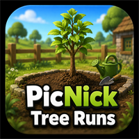

# Ironman Notes

Ironman mode disables GE restock and uses owned supplies, sapling preparation knowledge, shop buying notes, and capped shop-hop planning.

## Coded-In Ironman Supply Knowledge

The script currently knows these OSRS Wiki Farming shop locations:

| Shop | Location | Script Use |
| --- | --- | --- |
| Agelus' Farm Shop | Ortus Farm | Farming shop candidate |
| Alice's Farming shop | North-west of Port Phasmatys | Farming shop candidate |
| Allanna's Farming Shop | Farming Guild | Guild farming supplies |
| Amelia's Seed Shop | Farming Guild | Guild seed/supply candidate |
| Branwen's Farming Shop | Prifddinas | Farming shop candidate |
| Draynor Seed Market | Draynor Village | Seed shop candidate |
| Leprechaun Larry's Farming Supplies | Top of Troll Stronghold | Farming supply candidate |
| Richard's Farming shop | North of East Ardougne | Farming shop candidate |
| Sarah's Farming shop | South of Falador | Farming shop candidate |
| Vanessa's Farming shop | North of Catherby | Farming shop candidate |
| Vannah's Farming Stall | Hosidius market | Farming stall candidate |

Farmers at most Farming patches are coded as a fallback for unlimited plant cure, compost, rake, empty plant pot, watering can, gardening trowel, and seed dibber.

Garden Suppliers and bagged plants/trees are known, but bagged plants/trees are explicitly guarded as Construction/POH garden items. They are not Farming tree or fruit tree saplings and must not be planted in Farming patches.

| Item / Material | Coded Source Knowledge | Coded Location Knowledge | Script Intent |
| --- | --- | --- | --- |
| Plant pot | Farming shop stock or farmer fallback | 11 Farming shops + farmers at most patches | Buy when shop buying is enabled and bank/inventory does not have enough pots. |
| Plant pot pack | Farming shop pack stock | 11 Farming shops where stocked | Buy packs when loose pot stock is low. |
| Filled plant pot | Self-made from plant pot + soil | Any Farming patch soil, using gardening trowel | Prepare when sapling preparation is enabled. |
| Gardening trowel | Farming shop, farmer fallback, or tool leprechaun storage | 11 Farming shops + farmers + tool leprechauns | Required for filled-pot workflow. |
| Watering can | Farming shop, farmer fallback, or tool leprechaun storage | 11 Farming shops + farmers + refill at water sources | Required to water seedlings into saplings. |
| Rake | Farming shop, farmer fallback, or tool leprechaun storage | 11 Farming shops + farmers + tool leprechauns | Required when an empty patch is weeded. |
| Seed dibber | Farming shop, farmer fallback, or tool leprechaun storage | 11 Farming shops + farmers + tool leprechauns | Required to plant saplings. |
| Spade | Farming shop or tool leprechaun storage | 11 Farming shops + tool leprechauns | Required for planting/clearing/removing stumps. |
| Compost | Farming shop stock, farmer fallback, compost bins, or banked supplies | 11 Farming shops + farmers + compost bins | Lowest compost fallback. |
| Compost pack | Farming shop pack stock | 11 Farming shops where stocked | Buy packs when loose compost stock is low. |
| Tree seeds | Bird nests, farming contracts, seed packs, Wintertodt, drops | Banked progression sources | Used for self-prepared standard tree saplings when available. |
| Fruit tree seeds | Bird nests, farming contracts, seed packs, drops | Banked progression sources | Used for self-prepared fruit tree saplings when available. |
| Tree saplings | Grow from filled plant pot + seed + watering can | Bank/prep workflow | Used for standard tree patches. |
| Fruit tree saplings | Grow from filled plant pot + seed + watering can | Bank/prep workflow | Used for fruit tree patches. |
| Supercompost | Compost bin with suitable produce, banked supplies | Compost bins/banked produce | Middle compost fallback. |
| Ultracompost | Supercompost + volcanic ash | Volcanic ash + supercompost | Highest compost priority. |
| Farming Guild shop stock | Farming Guild seed shop / farming supplies | Farming Guild in Kebos Lowlands | Shop-stock/price-sensitive world-hop candidate when requirements are met. |
| Bagged plant/tree items | Garden Supplier decorative POH stock | Garden suppliers | Known but ignored for Farming tree patch planting. |
## Sapling Preparation Workflow

1. Confirm bank/inventory has a seed, plant pot or filled plant pot, gardening trowel, watering can, and free inventory space.
2. Fill plant pot with soil if only empty pots are available.
3. Use seed on filled plant pot to create a seedling.
4. Water the seedling with a watering can.
5. Wait until the watered seedling becomes a sapling.
6. Bank the finished sapling and rebuild the route from owned supplies.

## Capped Shop-Hopping Policy

- Only used when Ironman mode, shop buying, and shop world hopping are enabled.
- Intended for shop stock/price-sensitive supply buying.
- Uses capped hop attempts from Advanced settings.
- Stops/falls back instead of hopping endlessly.

## Current Limits To Keep Tracking

- Live shop buying quantity execution is still conservative and should be expanded from the log/planner proof.
- Quest/area validation is logged by patch requirement notes; full live quest-state detection should be added as DreamBot API support is verified.
